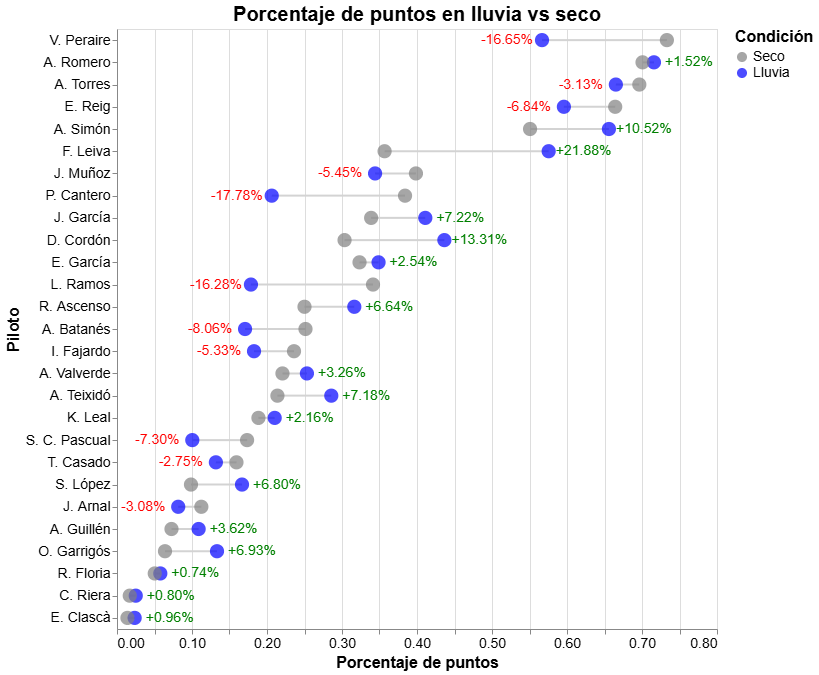

# FormulaSpain

Análisis y visualización de datos de la liga de F1 Online [Fórmu1aSpain](https://formulaspain1.wordpress.com/).

## Sistema de puntuación Elo
El sistema de puntuación Elo es un método para medir el nivel de habilidad relativo entre los participantes de un juego comptetitivo. Se popularizó a partir de su implementación en el ajedrez, pero actualmente se usa para una gran variedad de deportes y juegos competitivos. Normalmente se suele aplicar en contextos de duelo directo (ya sea individualmente o por equipos), donde los posibles resultados son: Victoria, Empate o Derrota. En una competición de carreras como la F1, donde el resultado es la posición final en una clasificación de 20 pilotos, hay varias formas de adaptar el sistema Elo. Aquí implementaremos un análogo directo al método utilizado en ejedrez. 

Desde el punto de vista de un piloto X, una carrera es una serie de enfrentamientos individuales contra los otros 19 pilotos y el resultado en cada uno de estos duelos depende si la posición final es superior o inferior a la del rival. En cierta medida, una carrera se podría entender como un torneo de ajedrez entre los 20 participantes, en el que todos se enfrentan mutuamente en algún momento. En realidad, debido a los diferentes formatos de carrera, como el formato sprint, y los puntos que se otorgan a la pole position, vuelta rápida y piloto del día, lo que se compara en realidad es el número de puntos obtenidos, con posibilidad de empate.

Sean $\{R_{1},...,R_{20}\}$ las puntuaciones Elo de los 20 pilotos antes de la carrera. Pongamos como ejemplo al piloto $1$, con un Elo de $R_1$. En su duelo particular contra el piloto $j$, con un Elo de $R_j$, tiene una puntuación esperada de

$$E_{1,j}=\frac{1}{1+10^{(R_j-R_1)/400}}$$.

Si el piloto 1 ha obtenido más puntos que el piloto 2, el resultado es $S_{1,j}=1$. Por lo tanto su nuevo Elo $R_1'$ a partir de este enfrentamiento es

$$R_1' = R_1 + K*(S_{1,j}-E_1)$$,

donde K es un factor que regula la variabilidad de la puntuación Elo.
Teniendo en cuenta que se tiene que enfrentar a los otros 19 pilotos, su nuevo Elo después de la carrera será

$$R_1' = R_1 + K*(\sum_{j=2}^{20}(S_{1,j}-E_1))$$.

Para calcular el cambio de Elo del piloto 2, se continuará usando R_1. Es decir, las nueva puntuaciones Elo se actualizaran al finalizar el cálculo de todas las variaciones.

### Evolución del Elo a lo largo de tres temporadas
Inicializamos los valores de estas puntuaciones en 1500, igual que en el ajedrez competivo. Con los datos de las tres temporadas que se han disputado en la liga, podemos obtener una visualización de la evolución del Elo a lo largo de las carreras. Esto muestra el nivel de habilidad relativa de cada piloto y su evolución a lo largo del tiempo. 

Hemos generado un gráfico interactivo en el que puedes seleccionar múltiples pilotos en la leyenda y comparar la evolución de su habilidad relativa a lo largo de estas tres temporadas [Ver gráfico interactivo](https://adriantorres7.github.io/FormulaSpain/notebooks/eloTemporadas.html).

Como ejemplo, aquí mostramos la evolución del Top 5 de la última temporada y el piloto con mayor Elo actualmente.

## Puntuación en condiciones de lluvia
Uno de los factores clave en el transcurso de una carrera puede ser la aparición de lluvia. Las condiciones de la pista cambian drásticamente cuando llueve, afectando significativamente al estilo de conducción necesario para poder rodar rápido y seguro. Las condiciones de mojado suelen favorecer más a unos pilotos que a otros, por lo que hemos querido obtener una comparativa entre el porcentaje de puntos obtenido en carreras en seco con el porcentaje de puntos obtenido en carreras en mojado.

Primero, definimos una carrera en mojado cuando algún piloto haya necesitado montar los neumáticos intermedios o de lluvia. En algunas ocasiones ha sido más beneficioso mantener los neumáticos de seco si quedaban pocas vueltas para finalizar la carrera. Pero si algún piloto ha montado neumáticos intermedios o de lluvia, ya consideramos la carrera en mojado. Hemos calculado 14 carreras (sobre las 74 en total) que pueden ser consideradas en mojado.

Segundo, la proporción de carreras en seco vs carreras en mojado es considerablemente desigual en favor de las carreras en seco. Por lo tanto, es necesario medir el rendimiento en cada condición con un valor relativo. En particular, definimos el porcentaje de puntos obtenido en seco para el piloto $i$, ${P_i^s}$, como

$${P_i^s} = \frac{\sum_{j\in I_i^s} P_{i,j} }{\sum_{j\in I_i^s}P_{max,j}}$$

donde $I_i^s$ son los índices correspondientes a las carreras en seco que ha disputado el piloto $i$, $P_{i,j}$ son los puntos obtenidos por el piloto $i$ en la carrera $j$ y $P_{max,j}$ son los máximos puntos posibles que un piloto puede obtener en la carrera $j$. Similarmente, el porcentaje de puntos obtenido en lluevia para el piloto $i$ es

$${P_i^l} = \frac{\sum_{j\in I_i^l} P_{i,j} }{\sum_{j\in I_i^l}P_{max,j}}$$

donde $I_i^l$ son los índices correspondientes a las carreras en lluvia que ha disputado el piloto $i$.

Hemos generado un gráfico donde podemos ver el aumento o reducción del porcentaje de puntos cuando pasamos de seco a lluvia.

También se puede consultar el gráfico interactivo en [https://adriantorres7.github.io/FormulaSpain/notebooks/lluvia.html](https://adriantorres7.github.io/FormulaSpain/notebooks/lluvia.html)
